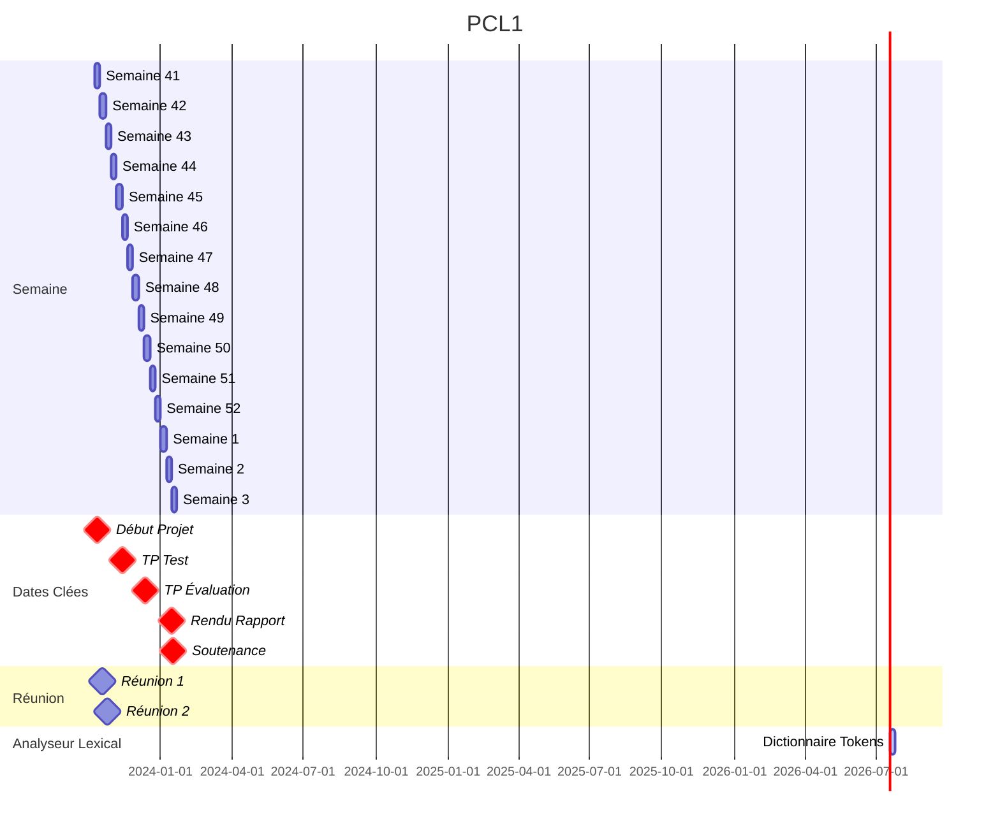

# Utiliser l'extension Markdown Preview Mermaid Support

```mermaid
gantt
    title PCL1
    dateFormat  YYYY-MM-DD

    section Semaine
    Semaine 41 : s1, 2023-10-9, 7d
    Semaine 42 : s2, after s1, 7d
    Semaine 43 : s3, after s2, 7d
    Semaine 44 : s4, after s3, 7d
    Semaine 45 : s5, after s4, 7d
    Semaine 46 : s6, after s5, 7d
    Semaine 47 : s7, after s6, 7d
    Semaine 48 : s8, after s7, 7d
    Semaine 49 : s9, after s8, 7d
    Semaine 50 : s10, after s9, 7d
    Semaine 51 : s11, after s10, 7d
    Semaine 52 : s12, after s11, 7d
    Semaine 1 : s13, after s12, 7d
    Semaine 2 : s14, after s13, 7d
    Semaine 3 : s15, after s14, 7d

    section Dates Clées
    Début Projet          :crit, milestone, d1, 2023-10-13,
    TP Test :crit, milestone, d5, 2023-11-14,
    TP Évaluation :crit, milestone, d4, 2023-12-12,
    Rendu Rapport :crit, milestone, d3, 2024-01-15,
    Soutenance :crit, milestone, d2, 2024-01-17,
    
    section Réunion
    Réunion 1 :milestone, r1, 2023-10-19,
    Réunion 2 :milestone, r2, 2023-10-25,

    section Analyseur Lexical
    Dictionnaire Tokens : active, al1, after a1, 7d
    

```